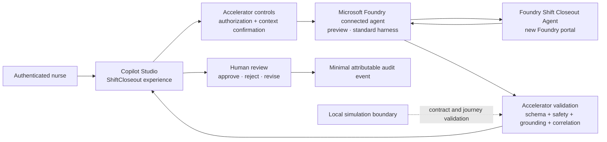

# Direct connected-agent architecture

**Status:** Target P0 binding selected; direct connected-agent validation
**NOT RUN**.

This view implements
[ADR-20260813-011](decisions/ADR-20260813-011.md). Microsoft Learn documents
the preview Copilot Studio path for adding a Microsoft Foundry agent with a
Foundry project endpoint and Agent Id. It does not document this accelerator's
structured contract adaptation or end-user identity propagation.

## Boundary notes

- The selected target path is direct; Power Automate is not an intermediary.
- The connected-agent feature is preview and powered by the standard harness.
- The connection setup uses a Foundry project endpoint, Name, Description, and
  Agent Id. The Foundry agent must have been created in the new portal.
- The diagram's control and validation components are accelerator requirements,
  not capabilities attributed to the connector.
- Issue #6 verified the isolated Foundry agent and its live behavior. It did not
  create or test the Copilot Studio connection.
- The direct connected-agent request/response adaptation and tenant behavior
  remain **NOT RUN**.

## Source

Microsoft Learn:
[Connect to a Microsoft Foundry agent (preview)](https://learn.microsoft.com/en-us/microsoft-copilot-studio/add-agent-foundry-agent),
reviewed 2026-08-13.
